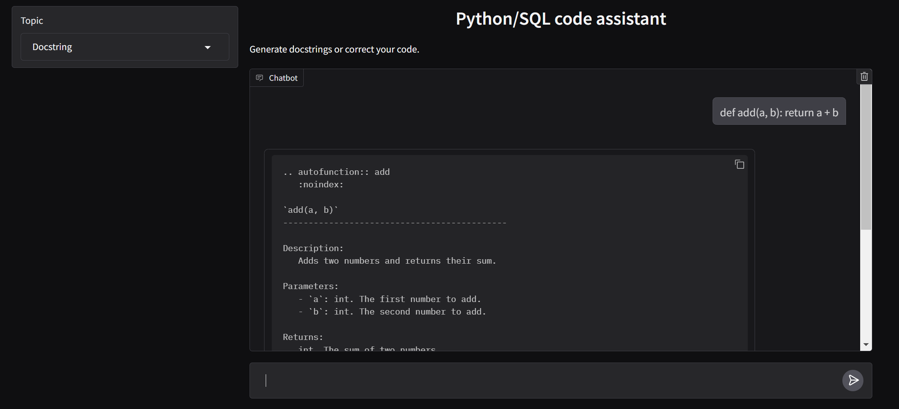

# 🧠 Code Assistant with LLM (Python & SQL)

This project is a lightweight **Gradio** interface that allows you to interact with Large Language Models (LLMs) to help you generate **docstrings**, correct **Python code**, and validate **SQL queries**.

It works locally using [**Ollama**](https://ollama.com/) as a backend, but it's easily adaptable to cloud services like **OpenAI**.

## 🚀 Features

- 📄 Automatically generate docstrings in **reStructuredText (reST)** format.
- 🐍 Correct Python functions with error detection and suggestions.
- 🗃️ Validate and correct SQL queries, including notes on differences between PostgreSQL, MySQL, and SQLite.
- 🧠 Configurable LLMs: choose the model you want (e.g., `qwen2.5-coder`, `llama3`, `gemma`, etc.).
- 🎛️ Simple web UI built with Gradio.

## 📸 Screenshot

 

## 🏗️ Requirements

- Python 3.8+
- [Ollama](https://ollama.com/) installed and running locally (can be replaced with OpenAI or other APIs)

### Dependencies

Install required packages:

```bash
pip install openai gradio pyyaml python-dotenv
```

## ⚙️ Configuration

By default, the app uses Ollama locally. You can define your environment variables in a `.env` folder:

```python
base_url = 'http://localhost:11434/v1'
api_key = 'ollama'
model = "qwen2.5-coder:7b"
```
To switch to OpenAI or another provider, change:    

```python   
base_url = 'https://api.openai.com/v1'
api_key = 'your-api-key-here'
model = 'your-model'
```
You can use any model compatible with OpenAI-style APIs. Examples:

`qwen2.5-coder:7b`

`llama3`

`deepseek-r1`

`gemma3`

⚠️ If you're using Ollama locally, make sure the model is downloaded and available.

## 🖥️ How to Use
Run the app with:

```python
python app.py
```
Then open your browser at http://localhost:7860

Select a topic:
- Docstring
- Python corrector
- SQL corrector

Paste your code and receive the model's response instantly.

## 🧩 Project Structure

``` bash
├── app.py              # Main app with Gradio UI 
├── llm_api.py          # Create class to manage LLM integration
├── prompts.yaml        # YAML file with prompts
├── README.md           # This file
├── assets/             # Folder with screenshot of the app
└── requirements.txt    # List of dependencies
```

## ✍️ Examples

### Generate a Docstring
```python
def add(a, b): return a + b
```
### Correct a Python Function
```python
def division(a, b):
    return a / b
```
### Fix an SQL Query
```SQL
SELECT * FROM users WHERE id = '1'
```

## 📦 Future Ideas
- Support for more languages (R, Bash, etc.)

- Auto-export docstrings back into source files

- CLI version of the tool

## 🤝 Contributing
Contributions are welcome! Feel free to open an issue or submit a pull request.

## 📄 License
This project is licensed under the MIT License.

Made with 💻 by [**Aranza1424**](https://github.com/aranza1424)